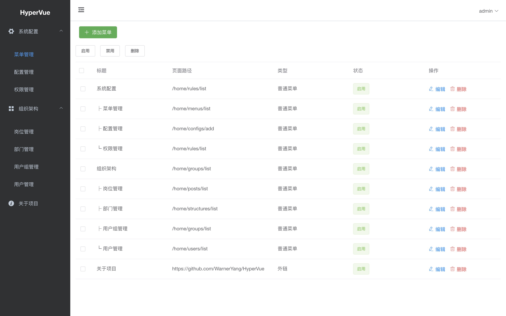
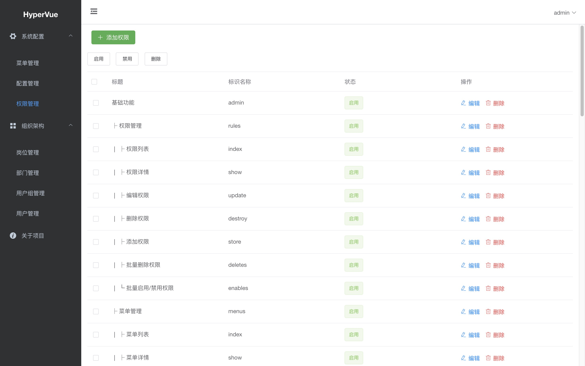

# HyperVue
🚀 基于 Hyperf + Vue + ElementUI 前后端分离的通用型管理后台

- [hyperf 1.1](https://github.com/hyperf/hyperf)
- [vue 2.0](https://github.com/hyperf/hyperf)
- [element-ui 2.12](https://github.com/hyperf/hyperf)

## 预览



## 如何使用
获取源码
```
git clone https://github.com/WarnerYang/HyperVue.git
```

#### hyperf 部署
下载并运行 hyperf/hyperf 镜像，并将镜像内的项目目录绑定到宿主机的hyperVue下的hyperf目录（windows用powershell）

```
cd hyperf
pwd 我的目录这里是 /Users/yhq/wwwroot/learn/HyperVue/hyperf

docker run --name hyperVue-hyperf -v /Users/yhq/wwwroot/learn/HyperVue/hyperf:/hyperVue-hyperf -p 9501:9501 -it --entrypoint /bin/sh hyperf/hyperf:7.2-alpine-cli

```
以下在容器中操作
```
# 镜像容器运行后，在容器内安装 Composer
wget https://github.com/composer/composer/releases/download/1.8.6/composer.phar
chmod u+x composer.phar
mv composer.phar /usr/local/bin/composer

# 将 Composer 镜像设置为阿里云镜像，加速国内下载速度
composer config -g repo.packagist composer https://mirrors.aliyun.com/composer

# 进入安装好的 Hyperf 项目目录
cd hyperVue-hyperf

# 安装依赖
composer install

# 复制env文件
cp .env.example .env

# 导入数据库 hyperVue.sql

# 修改env文件里面的相关参数，保存退出
vi .env

# 启动 Hyperf
php bin/hyperf.php start
```

#### vue 部署
```
# 下载并运行node镜像，并将镜像内的项目目录绑定到宿主机的hyperVue下的vue目录
docker run --name hyperVue-vue -v /home/wwwroot/hyperVue/vue:/hyperVue-vue  -it --entrypoint /bin/sh node:latest
```
以下在容器中运行
```
# 安装vim
apt-get update
apt-get install vim

# 修改接口地址
vim /hyperVue-vue/build/webpack.base.conf.js
# 改成对应接口地址
var PUB_HOST = JSON.stringify('http://127.0.0.1:9501/')

# 将 npm 镜像设置为淘宝镜像cnpm，加速国内下载速度
npm install -g cnpm --registry=https://registry.npm.taobao.org

# 安装依赖
cnpm install

# 本地调试
npm run dev

# 构建
npm run build
```

## 一些常用命令
```
#进入容器
docker exec -it hyperVue-vue /bin/sh

查看扩展信息
php --ri swoole

查看composer包信息
composer info | grep hyperf

请求
curl  127.0.0.1:9501/admin/base/getConfigs -w %{http_code}

参数：
-w %{http_code}
-X POST

自动化测试
https://phpunit.readthedocs.io/zh_CN/latest/writing-tests-for-phpunit.html
# 重新生成代理类
php bin/hyperf.php di:init-proxy
# 运行单元测试
composer test
composer test -- --filter=testFoo

# 类名： class FooTest extends HttpTestCase

# 方法名：
public function testFoo(){} 
或者
/**
* @test
*/
public function foo(){}
```
> 免责声明: 该项目仅作为学习使用，如投入生产所产生的损失由使用者自己承担！！！